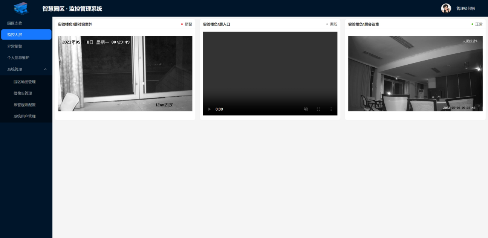
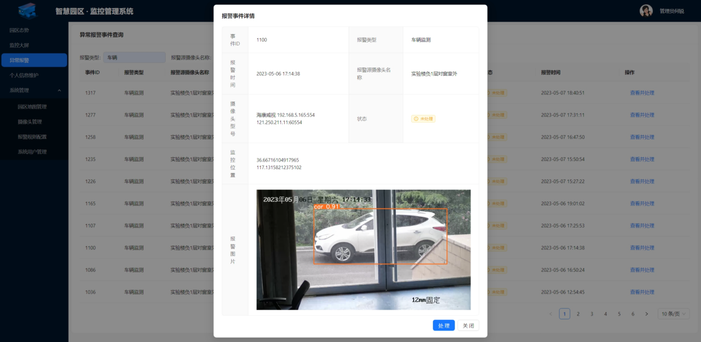
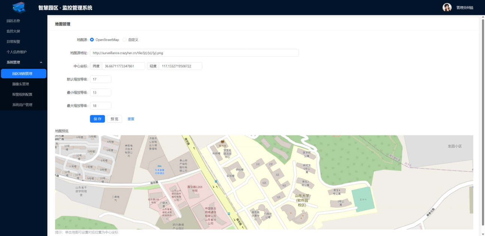
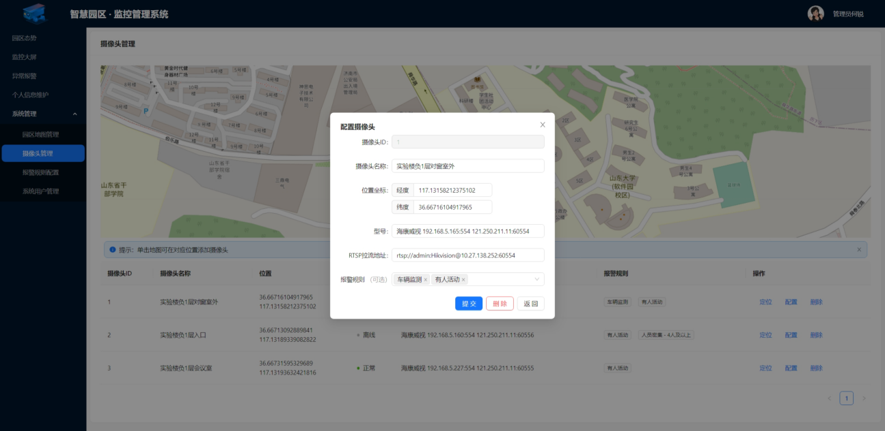
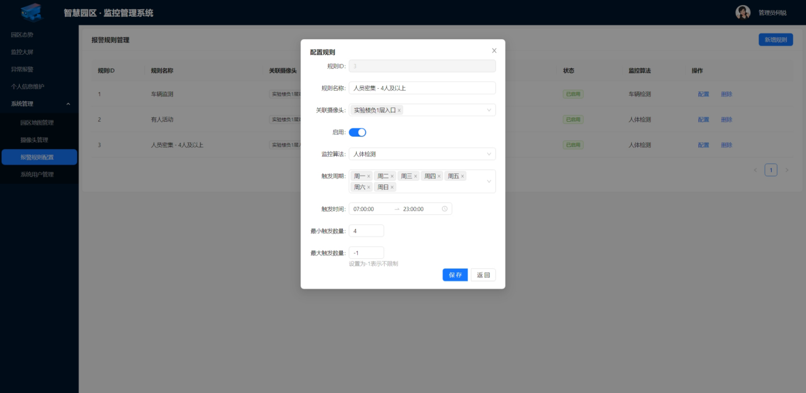
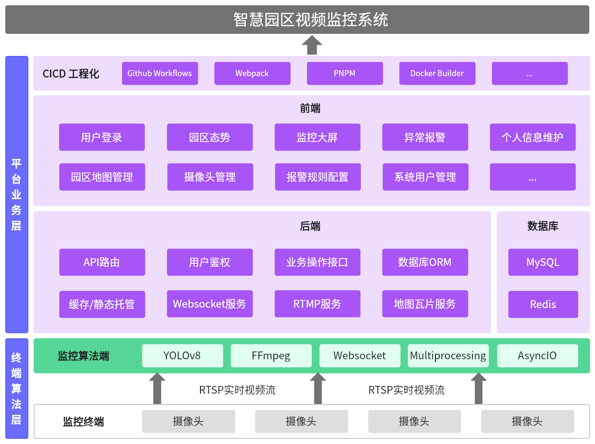
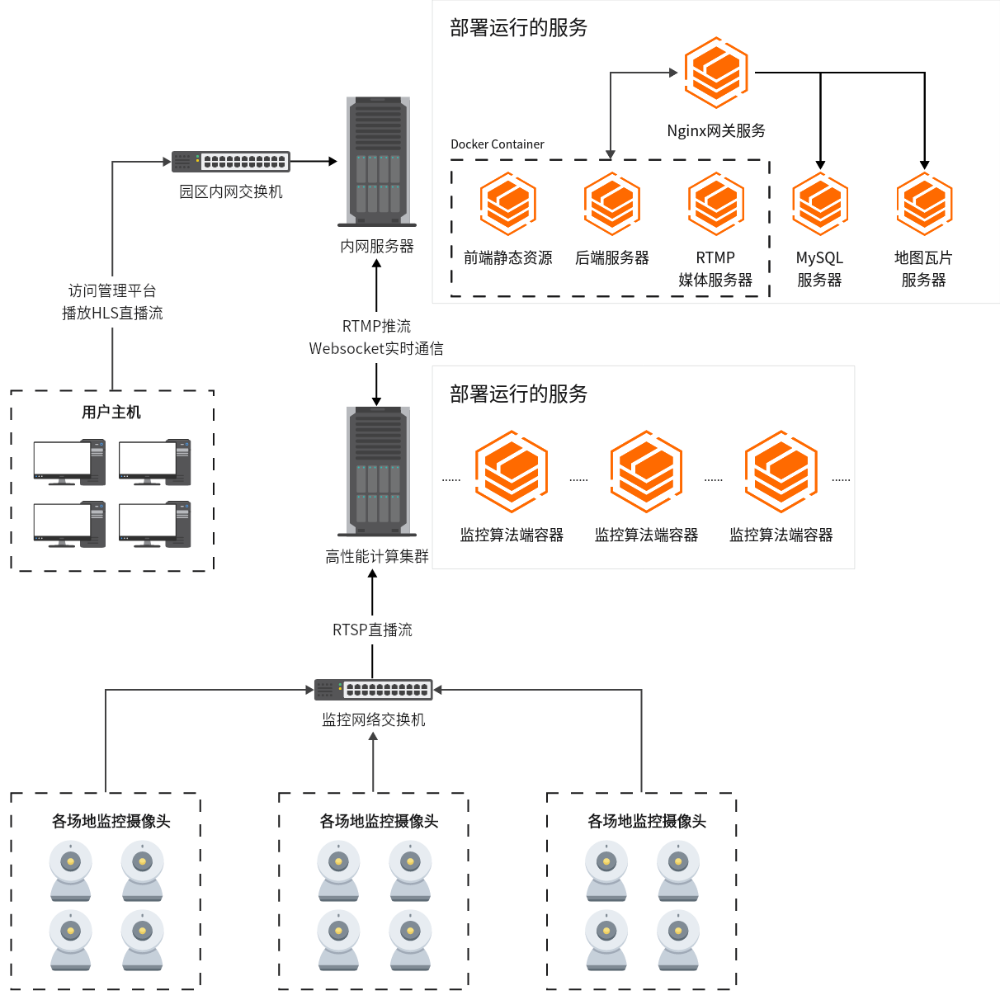

# 基于服务器本地地图的园区视频监控 web 系统

<p align="center">
  <a href="https://hub.docker.com/r/crazyher/campus-surveillance-system">
    
  </a>

  <a href="https://hub.docker.com/r/crazyher/campus-surveillance-ai-end">
    
  </a>

  <a href="https://github.com/CrazyHer/campus-surveillance-system/actions/workflows/lint.yaml">
    
  </a>

  <a href="https://github.com/CrazyHer/campus-surveillance-system/actions/workflows/docker-image.yaml">
    
  </a>

</p>

## 简介

传统园区视频监控系统不存储园区 GIS 地图，也没有精确记录各个摄像头的地理位置信息和相对位置关系，不便于监控的调取和管理。同时，传统园区视频监控系统还需要工作人员值守监视画面，并在出现异常情况时需人工研判并上报事件。这大大限制了园区视频监控系统的易用性、实时性、可靠性、安全性和效率，抬高了时间成本和人力成本。

针对传统园区视频监控系统面临的问题，通过参考目前业界的主流技术方向和最佳实践，本文设计并开发实现了一套基于服务器本地地图和深度学习技术的智能园区视频监控系统。

本系统实现了地图瓦片数据和自定义园区地图的服务器本地保存、加载和渲染，多摄像头直播画面的播放，多摄像头基于其园区地理位置的管理，基于实时监控画面对异常事件的检测报警和管理，异常事件报警的触发规则的定义和管理以及系统角色权限的管理，并完成了系统测试。

## 主要功能截图








## 系统说明

系统架构主要具体划分为前端、后端、监控算法端、RTMP 媒体服务器和地图瓦片服务器 5 个主要部分。  
其中，前端提供系统管理平台的用户界面，后端负责处理 HTTP 请求和 Websocket 连接及相关业务操作，监控算法端负责使用深度学习算法对监控摄像头画面进行异常事件的侦测与报警，RTMP 媒体服务器负责摄像头实时画面收流并提供 HLS 协议的低延迟直播服务，地图瓦片服务器负责对园区地图模型进行计算并切分为各种大小的瓦片以提供给前端进行地图的渲染。

### 技术架构



### 部署架构



### 部署和使用

前后端和 RTMP 服务器统一打包构建为 Docker Image：[crazyher/campus-surveillance-system](https://hub.docker.com/repository/docker/crazyher/campus-surveillance-system)

```shell
docker run  -p 8080:80 \
            -p 1515:1515 \
            -e MYSQL_HOST=172.17.0.1 \
            -e MYSQL_PORT=3306 \
            -e MYSQL_DATABASE=campus-surveillance-system \
            -e MYSQL_USER=root \
            -e MYSQL_PASSWORD=root \
            -e JWT_SECRET=secret \
            --name campus-surveillance-system \
            -d crazyher/campus-surveillance-system:latest
```

其中容器内 80 端口是 HTTP 服务，1515 是 RTMP 服务

监控算法端单独打包构建为 Docke Image：[crazyher/campus-surveillance-ai-end](https://hub.docker.com/repository/docker/crazyher/campus-surveillance-ai-end/general)

```shell
docker run -e HTTP_SERVER_URL="http://172.17.0.1" \
           -e RTMP_SERVER_URL="rtmp://172.17.0.1:1515/live" \
           -e ADMIN_USERNAME="admin" \
           -e ADMIN_PASSWORD="admin" \
           --name campus-surveillance-ai-end \
           -d crazyher/campus-surveillance-ai-end:latest
```

### 前端

前端页面采用 React 技术栈编写，并嵌入 leaflet 地图渲染引擎以加载自定义图层。监控视频的实时流播放采用 HLS 协议。其中的 HLS 播放器使用 hls.js。

### 后端

后端使用 Typescript 语言并基于 Node.js 的 Nest 框架编写，主要负责处理业务逻辑，包括保存自定义园区地图数据、数据库 IO、提供前端管理操作的接口和监控算法端的事件上报接口。通过与监控算法端的解耦，以避免 AI 算法影响后端性能和稳定性。

### 监控算法端

监控算法端使用 Python 编写，主要任务是拉取监控摄像头提供的 RTSP/RTMP 流，以 RTMP 的格式推给本系统的 RTMP 服务器，同时对流画面基于深度学习算法进行实时检测。

摄像头配置的获取和异常事件的上报通过与后端 Websocket 实时通信完成。

基本流程：

1. 与后端建立 WS 连接
2. 后端验证管理员账号密码，鉴权通过后由后端下发摄像头配置规则和拉流地址
3. 为每一个摄像头创建工作进程，在其中：
   - 启动子线程执行 ffmpeg 把摄像头原始拉流地址推流给 RTMP 服务器
   - 对原始拉流地址基于配置的报警规则做实时目标检测。
