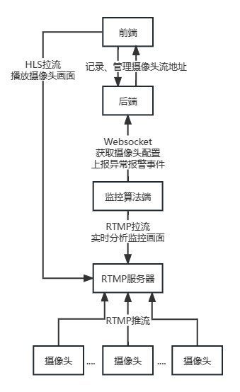

# 基于服务器本地地图的园区视频监控 web 系统

<p align="center">
  <a href="https://hub.docker.com/r/crazyher/campus-surveillance-system">
    
  </a>

  <a href="https://hub.docker.com/r/crazyher/campus-surveillance-system">
    
  </a>

  <a href="https://hub.docker.com/r/crazyher/campus-surveillance-system">
    
  </a>
</p>

## 题目介绍

摄像头已经成为公共区域和园区监控的主要检测设备。相较于公共区域，园区安防所使用的监控摄像头数量更多、分布也较为复杂。当今主流的传统视频监控系统并没有精确记录各个摄像头的地理位置信息和相对位置关系，而管理人员也只是将摄像头按照地理区域进行命名编号以区分，并不能在系统上直观地找到并分析各个摄像头之间的位置关系。当园区层数较多、地域空间复杂时，不便于监控的调取和管理。

同时，传统园区监控系统还需要工作人员值守监视画面，并在出现异常情况时需人工研判并上报事件。这大大限制了园区监控的可靠性、安全性、效率，并抬高了时间成本和人力成本。

因此，针对上述传统园区监控所面临的问题，设计并实现了一套基于服务器本地地图和深度学习技术的智能园区视频监控 web 系统，加载自定义本地园区地图数据，在摄像头位置加载到地图上，并进行视频流显示和管理；基于深度学习算法，对监控画面实时监测区域入侵、人员聚集、人员离岗等异常事件，能够自动识别并进行异常报警。

## 主要功能截图

待补充

## 系统说明

### 架构

系统架构主要由 web 前后端、RTMP 服务器、监控算法端以及摄像头四部分组成，如下图：  


PS：若要本地搭建地图切片服务器，可参考[openstreetmap-tile-server](https://github.com/Overv/openstreetmap-tile-server)，使用 Docker 搭建服务器提供本地 OpenStreetMap 地图切片

### 部署和使用

前后端和 RTMP 服务器统一打包构建为 Docker Image：[crazyher/campus-surveillance-system](https://hub.docker.com/repository/docker/crazyher/campus-surveillance-system)

```shell
docker run  -p 8080:80 \
            -p 1515:1515 \
            -e MYSQL_HOST=localhost \
            -e MYSQL_PORT=3306 \
            -e MYSQL_DATABASE=campus-surveillance-system \
            -e MYSQL_USER=root \
            -e MYSQL_PASSWORD=root \
            -e JWT_SECRET=secret \
            --name campus-surveillance-system \
            -d crazyher/campus-surveillance-system:latest
```

其中容器内 80 端口是 HTTP 服务，1515 是 RTMP 服务

监控算法端单独打包构建为 Docke Image：[crazyher/campus-surveillance-ai-end](https://hub.docker.com/repository/docker/crazyher/campus-surveillance-ai-end/general)

```shell
docker run -e WS_SERVER_URL="ws://localhost/ws" \
           -e RTMP_SERVER_URL="rtmp://localhost:1515/live" \
           -e ADMIN_USERNAME="admin" \
           -e ADMIN_PASSWORD="admin" \
           -e CAMERA_IDS="1,2,3" \
           --name campus-surveillance-ai-end \
           -d crazyher/campus-surveillance-ai-end:latest
```

### 前端

前端页面采用 React 技术栈编写，并嵌入 leaflet 地图渲染引擎以加载自定义图层。监控视频的实时流播放采用 HLS 协议。其中的 HLS 播放器使用 hls.js。

### 后端

后端使用 Typescript 语言并基于 Node.js 的 Nest 框架编写，主要负责处理业务逻辑，包括保存自定义园区地图数据、数据库 IO、提供前端管理操作的接口和监控算法端的事件上报接口。通过与监控算法端的解耦，以避免 AI 算法影响后端性能和稳定性。

### 监控算法端

监控算法端使用 Python 编写，主要任务是拉取监控摄像头提供的 RTSP/RTMP 流，以 RTMP 的格式推给本系统的 RTMP 服务器，同时对流画面基于深度学习算法进行实时检测。

摄像头配置的获取和异常事件的上报通过与后端 Websocket 实时通信完成。

基本流程：

1. 与后端建立 WS 连接
2. 后端验证管理员账号密码，鉴权通过后由后端下发摄像头配置规则和拉流地址
3. 为每一个摄像头创建工作进程，在其中：
   - 启动子线程执行 ffmpeg 把摄像头原始拉流地址推流给 RTMP 服务器
   - 对原始拉流地址基于配置的报警规则做实时目标检测。
